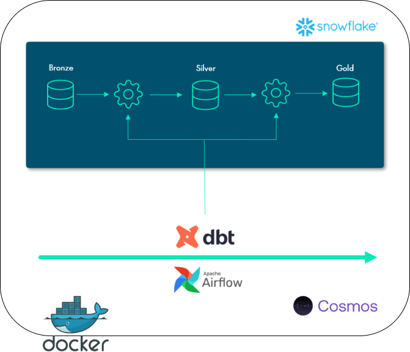
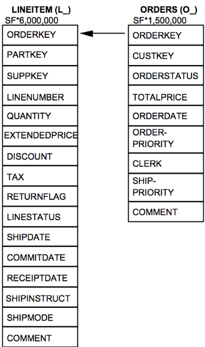
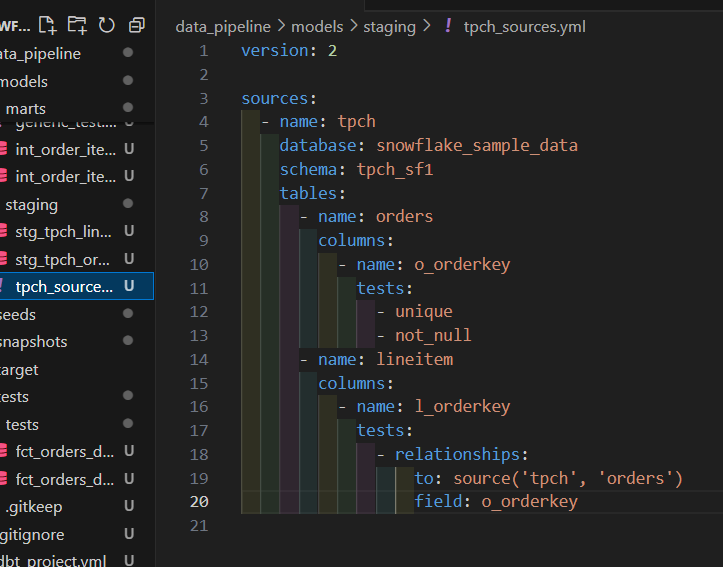
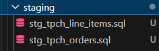
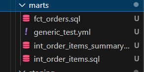

# Snowflake & dbt ELT Data Pipeline 

## Project Overview

This project demonstrates a robust data pipeline that processes and transforms raw data into analytics-ready data marts using dbt with Snowflake as the data warehouse and Apache Airflow for orchestration through Astronomer's Cosmos.

## Technologies Used

* **Containarization**: Docker
* **Workflow orchestration**: Airflow, Astronomer's Cosmos
* **Data Warehouse**: Snowflake
* **Transformation**: dbt

## Data Ingestion

TPC-H is a decision support benchmark. It consists of a suite of business-oriented ad hoc queries and concurrent data modifications. The queries and the data populating the database have been chosen to have broad industry-wide relevance. This benchmark illustrates decision support systems that examine large volumes of data, execute queries with a high degree of complexity, and give answers to critical business questions.

## Data Transformation

1. Bronze Layer

Data Source: Snowflake Sample Data - TPC-H dataset.
Purpose: Preserve raw data as-is for reference and auditing.

2. Silver Layer

3. Golden Layer

### Data Warehouse

## Data Pipeline 

My pipeline fetches the data from APIs, loads it to Google Cloud Storage, then doing the unnecessary transformations and load it again to Google BigQuery.

All steps are orchestrated in Airflow.

## Pipeline Automation

After setting up my pipline, I made a daily trigger to run it and collect new data (if exists)

## Reproducibility

1. Set Up the Environment:
Install required tools: dbt, Snowflake, and Apache Airflow.
Configure your machine with the necessary credentials to access Snowflake.
Prepare Snowflake Database

2. Load the TPC-H sample data into Snowflake.
Ensure database, schema, and warehouse settings are properly configured.
Configure dbt

3. Set up a profiles.yml file to connect dbt to your Snowflake account.
Place the dbt project files in the correct directory structure: models, macros, and tests.
Run dbt Models

4. Start with the raw (bronze) layer, progress to the staging (silver) layer, and finally build the marts (golden) layer.
Perform testing to ensure data accuracy.

5. Configure Airflow and Cosmos:
Set up the necessary Airflow connections for Snowflake and other dependencies.
Integrate Cosmos to manage dbt workflows efficiently.

6. Run the ETL Workflow:
Use the Airflow UI to monitor and trigger DAGs.
Cosmos handles the orchestration, automatically generating Airflow DAGs from dbt workflows.

## Improvements
Enhanced Testing:
- Add more singular tests for specific business logic validations.
- Implement alerting for failed tests or pipeline failures using Airflow email operators.

Advanced Analytics:
- Incorporating snowflake snowpark for more advanced analytics

Visualization:
- Integrate BI tools like Tableau or Power BI to visualize marts/golden data.

